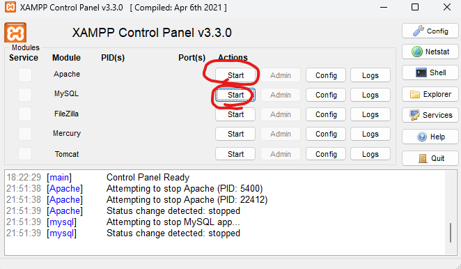
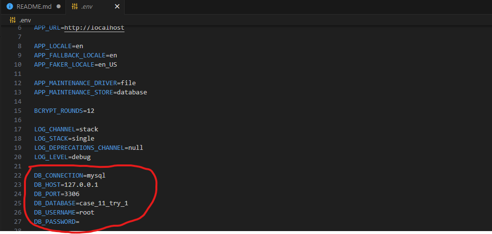

Eğer bilgisayarınızda PHP ve Composer yüklü değilse , lütfen yükleyin

<b>composer global require laravel/installer</b>
 

Bu komutla laravel'i global olarak yükleyeceksiniz.

Daha sonrasında bilgisayarınızda XAMPP kurulu olmalı, xamppı kurduktan sonra default ayarlarıyla

Apache Server ve MySQL başlatmanız gerekli.

 

 

Başlattıktan sonra .env dosyanızda SQL connection'ı doğru yazdığınızdan emin olun.

<b>Terminalde sırasıyla çalıştırmanız gereken komutlar ;</b>

<li>
    php artisan migrate
     
    <small>Eğer Database localhostta bulunmuyorsa, size oluşturması için soracak, yes yazıp komutu çalıştırın.</small>
</li>
<li>
    php artisan db:seed
     
    <small>Gerekli kategori ve tag verilerini ekleyecektir.</small>
</li>
<li>
    php artisan l5-swagger:generate
     
    <small>Swagger Api Dökümasyonu oluşturacaktır.</small>
</li>
<li>
    php artisan serve
     
    <small>son olarak bu komutla artık servisleriniz çalışır hale gelecek.</small>
</li>
<li>
    http://localhost:8000/api/documentation
     
    bu adrese giderek de , dökümana ulaşabilirsiniz.
</li>

